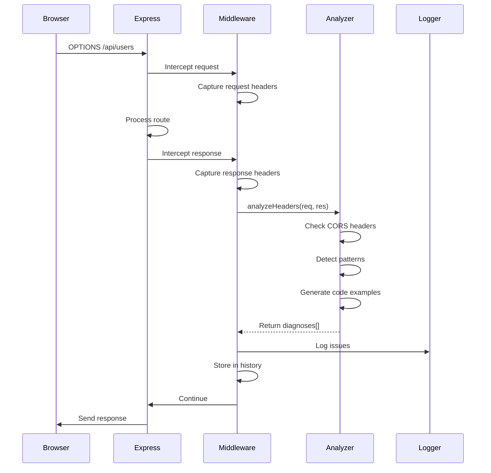
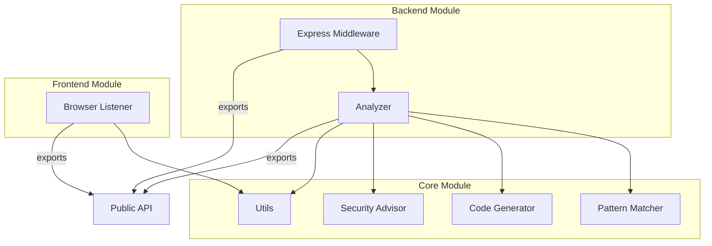

# Design Document - cors-diagnoser

## Overview

O cors-diagnoser é um pacote NPM TypeScript que fornece diagnóstico inteligente e automatizado de problemas CORS. O sistema é composto por três módulos principais: backend (Express middleware), frontend (browser listener) e core (análise e utilitários). A arquitetura é modular, permitindo uso independente de cada componente ou integração completa.

O design prioriza developer experience através de mensagens claras, exemplos de código acionáveis, detecção de padrões comuns e sugestões de segurança contextuais.

## Architecture

### High-Level Architecture

```
┌─────────────────────────────────────────────────────────────┐
│                     cors-diagnoser                          │
├─────────────────────────────────────────────────────────────┤
│                                                             │
│  ┌──────────────┐  ┌──────────────┐  ┌──────────────┐    │
│  │   Backend    │  │   Frontend   │  │     Core     │    │
│  │   Module     │  │    Module    │  │    Module    │    │
│  └──────────────┘  └──────────────┘  └──────────────┘    │
│         │                 │                  │             │
│         │                 │                  │             │
│         └─────────────────┴──────────────────┘             │
│                           │                                │
│                    ┌──────▼──────┐                        │
│                    │   Analyzer   │                        │
│                    │    Engine    │                        │
│                    └──────────────┘                        │
│                                                             │
└─────────────────────────────────────────────────────────────┘
```

### Module Responsibilities

**Backend Module**

- Intercepta requisições HTTP no Express
- Captura headers de request/response
- Detecta requisições OPTIONS (preflight)
- Mantém histórico de erros em memória
- Integra com Analyzer Engine

**Frontend Module**

- Escuta erros globais no navegador
- Filtra erros relacionados a CORS
- Formata mensagens para console do navegador
- Fornece explicações contextuais

**Core Module**

- Analyzer Engine: lógica central de diagnóstico
- Pattern Matcher: detecta padrões comuns de erro
- Code Generator: gera exemplos de código
- Security Advisor: valida configurações de segurança
- Utils: funções auxiliares compartilhadas

## Components and Interfaces

### 1. Backend Module

#### expressMiddleware.ts

```typescript
export interface CorsMiddlewareOptions {
  verbose?: boolean;
  enableHistory?: boolean;
  maxHistorySize?: number;
  securityChecks?: boolean;
}

export interface CorsError {
  timestamp: Date;
  route: string;
  method: string;
  origin: string;
  diagnoses: Diagnosis[];
  count: number;
}

export function corsDiagnoser(options?: CorsMiddlewareOptions): Handler;
export function getErrorHistory(): CorsError[];
export function clearErrorHistory(): void;
```

**Implementação:**

- Middleware intercepta req/res usando wrapper pattern
- Captura headers antes e depois do processamento da rota
- Para requisições OPTIONS, valida headers CORS obrigatórios
- Armazena erros em array circular (max 100 itens)
- Agrupa erros idênticos incrementando contador
- Chama Analyzer Engine para gerar diagnósticos

#### analyzer.ts

```typescript
export interface Diagnosis {
  issue: string;
  description: string;
  recommendation: string;
  codeExample?: string;
  pattern?: string;
  severity?: "info" | "warning" | "critical";
}

export interface CorsConfiguration {
  origin: string | string[] | boolean;
  methods?: string[];
  allowedHeaders?: string[];
  exposedHeaders?: string[];
  credentials?: boolean;
  maxAge?: number;
}

export function analyzeHeaders(req: Request, res: Response): Diagnosis[];

export function compareConfiguration(
  current: CorsConfiguration,
  expected: CorsConfiguration
): ConfigurationDiff;

export function testOrigin(
  origin: string,
  config: CorsConfiguration
): TestResult;
```

**Implementação:**

- `analyzeHeaders`: verifica presença e validade de cada header CORS
- Detecta conflitos (ex: credentials + wildcard origin)
- Identifica headers customizados não permitidos
- Chama Pattern Matcher para classificar erro
- Chama Code Generator para criar exemplos
- Chama Security Advisor para validações de segurança

### 2. Frontend Module

#### browserListener.ts

```typescript
export interface BrowserListenerOptions {
  verbose?: boolean;
  autoStart?: boolean;
  customHandler?: (error: CorsErrorInfo) => void;
}

export interface CorsErrorInfo {
  message: string;
  possibleCauses: string[];
  recommendations: string[];
  timestamp: Date;
}

export function listenCorsErrors(options?: BrowserListenerOptions): void;
export function stopListening(): void;
export function getCorsErrors(): CorsErrorInfo[];
```

**Implementação:**

- Registra listener em `window.addEventListener('error')`
- Filtra erros que contêm "CORS", "cross-origin", "blocked"
- Analisa mensagem de erro para identificar causa provável
- Mapeia para padrões conhecidos (missing header, preflight fail, etc)
- Formata output com console.group para melhor legibilidade
- Armazena histórico de erros capturados

### 3. Core Module

#### patternMatcher.ts

```typescript
export interface ErrorPattern {
  id: string;
  name: string;
  detector: (req: Request, res: Response) => boolean;
  explanation: string;
  solution: string;
  codeExample: string;
}

export const COMMON_PATTERNS: ErrorPattern[] = [
  // wildcard-credentials-conflict
  // multiple-origins-misconfiguration
  // preflight-only-failure
  // custom-headers-not-allowed
  // missing-allow-origin
  // missing-allow-headers
  // missing-allow-methods
  // credentials-mismatch
  // origin-null-blocked
  // port-mismatch
];

export function detectPattern(req: Request, res: Response): ErrorPattern | null;
```

**Implementação:**

- Array de padrões com funções detector
- Cada detector verifica condições específicas
- Retorna primeiro padrão que corresponde
- Inclui explicação e solução específica para cada padrão

#### codeGenerator.ts

```typescript
export interface CodeExample {
  language: string;
  code: string;
  description: string;
}

export function generateExpressExample(
  issue: string,
  context: any
): CodeExample;

export function generateFetchExample(issue: string, context: any): CodeExample;

export function formatCodeForConsole(code: string, language: string): string;
```

**Implementação:**

- Templates para configurações comuns de CORS
- Substitui placeholders com valores contextuais
- Gera exemplos para Express, Fastify, fetch, axios
- Adiciona syntax highlighting usando ANSI codes para terminal
- Formata com indentação e comentários explicativos

#### securityAdvisor.ts

```typescript
export interface SecurityIssue {
  level: "info" | "warning" | "critical";
  title: string;
  description: string;
  recommendation: string;
}

export function checkSecurity(
  config: CorsConfiguration,
  environment?: "development" | "production"
): SecurityIssue[];
```

**Implementação:**

- Valida wildcard origin em produção
- Detecta credentials + wildcard (crítico)
- Verifica headers sensíveis expostos
- Valida métodos HTTP permitidos
- Retorna lista priorizada por severidade

#### utils.ts

```typescript
export function normalizeOrigin(origin: string): string;
export function parseHeaders(headers: any): Map<string, string>;
export function isPreflightRequest(req: Request): boolean;
export function formatLog(
  level: "info" | "warn" | "error",
  message: string,
  data?: any
): void;
export function colorize(text: string, color: string): string;
```

**Implementação:**

- Normalização de URLs (remove trailing slash, lowercase)
- Parsing de headers case-insensitive
- Detecção de preflight (método OPTIONS + headers específicos)
- Formatação de logs com cores ANSI
- Helpers para manipulação de strings

### 4. Main Entry Point

#### index.ts

```typescript
// Backend exports
export {
  corsDiagnoser,
  getErrorHistory,
  clearErrorHistory,
  type CorsMiddlewareOptions,
  type CorsError,
} from "./backend/expressMiddleware";

export {
  analyzeHeaders,
  compareConfiguration,
  testOrigin,
  type Diagnosis,
  type CorsConfiguration,
} from "./backend/analyzer";

// Frontend exports
export {
  listenCorsErrors,
  stopListening,
  getCorsErrors,
  type BrowserListenerOptions,
  type CorsErrorInfo,
} from "./frontend/browserListener";

// Core exports (advanced usage)
export {
  detectPattern,
  COMMON_PATTERNS,
  type ErrorPattern,
} from "./core/patternMatcher";

export { checkSecurity, type SecurityIssue } from "./core/securityAdvisor";
```

## Data Models

### Diagnosis Object

```typescript
interface Diagnosis {
  issue: string; // "Missing Access-Control-Allow-Origin"
  description: string; // Detailed explanation
  recommendation: string; // Action to take
  codeExample?: string; // Ready-to-use code
  pattern?: string; // Pattern ID if detected
  severity?: "info" | "warning" | "critical";
}
```

### CorsError Object (History)

```typescript
interface CorsError {
  timestamp: Date;
  route: string; // "/api/users"
  method: string; // "GET" | "POST" | "OPTIONS"
  origin: string; // "https://example.com"
  diagnoses: Diagnosis[]; // List of issues found
  count: number; // Number of occurrences
}
```

### ConfigurationDiff Object

```typescript
interface ConfigurationDiff {
  missing: string[]; // Properties not in current config
  incorrect: Array<{
    property: string;
    current: any;
    expected: any;
  }>;
  extra: string[]; // Properties not needed
  summary: string; // Human-readable summary
}
```

### TestResult Object

```typescript
interface TestResult {
  allowed: boolean;
  reason?: string; // If blocked, why
  headers: Record<string, string>; // Headers that would be sent
  preflight: {
    required: boolean;
    allowed: boolean;
  };
}
```

## Error Handling

### Backend Error Handling

1. **Middleware Errors**: Wrapped in try-catch, logged but não bloqueiam requisição
2. **Analysis Errors**: Retornam diagnosis com severity 'critical' indicando erro interno
3. **History Overflow**: Implementa circular buffer, remove entradas mais antigas
4. **Invalid Configuration**: Valida options no início, usa defaults para valores inválidos

### Frontend Error Handling

1. **Listener Registration**: Verifica se window existe (SSR safety)
2. **Error Parsing**: Trata mensagens de erro variadas entre browsers
3. **Console Errors**: Wrapped em try-catch para não quebrar aplicação
4. **Memory Leaks**: Cleanup automático ao chamar stopListening()

### Error Recovery

- Middleware nunca lança exceções que quebrem o servidor
- Análise parcial: retorna diagnoses disponíveis mesmo se alguma verificação falhar
- Graceful degradation: funcionalidades avançadas falham silenciosamente

## Testing Strategy

### Unit Tests

**Backend Module**

- `expressMiddleware.test.ts`: testa interceptação, histórico, agrupamento
- `analyzer.test.ts`: testa cada função de análise isoladamente
- Mock de req/res objects do Express

**Frontend Module**

- `browserListener.test.ts`: testa captura de erros, filtragem
- Mock de window.addEventListener
- Simula diferentes mensagens de erro de browsers

**Core Module**

- `patternMatcher.test.ts`: valida detecção de cada padrão
- `codeGenerator.test.ts`: verifica templates e substituições
- `securityAdvisor.test.ts`: testa cada regra de segurança
- `utils.test.ts`: testa funções auxiliares

### Integration Tests

**End-to-End Backend**

- Servidor Express real com middleware instalado
- Requisições HTTP reais de diferentes origens
- Valida logs gerados e histórico

**End-to-End Frontend**

- Ambiente JSDOM ou Playwright
- Simula erros CORS reais
- Valida mensagens no console

### Test Coverage Goals

- Mínimo 80% coverage em todas as funções críticas
- 100% coverage em pattern matchers
- 100% coverage em security checks

### Testing Tools

- Jest como test runner
- Supertest para testes de Express
- JSDOM para testes de browser
- ts-jest para TypeScript

## Performance Considerations

### Memory Management

- Histórico limitado a 100 entradas (configurável)
- Circular buffer para evitar crescimento infinito
- Cleanup automático de listeners no frontend

### CPU Optimization

- Análise lazy: só executa quando erro detectado
- Pattern matching com early exit
- Cache de configurações normalizadas

### Network Impact

- Middleware adiciona overhead mínimo (<1ms por requisição)
- Análise só ocorre em caso de erro ou verbose mode
- Sem requisições externas

## Security Considerations

### Input Validation

- Sanitização de headers antes de logging
- Validação de origins contra regex
- Escape de strings em exemplos de código

### Information Disclosure

- Logs não expõem tokens ou credenciais
- Filtragem de headers sensíveis (Authorization, Cookie)
- Modo verbose desabilitado por padrão em produção

### Dependency Security

- Zero dependencies em runtime
- Dev dependencies auditadas regularmente
- TypeScript strict mode habilitado

## Deployment and Distribution

### NPM Package Structure

```
cors-diagnoser/
├── dist/
│   ├── index.js
│   ├── index.d.ts
│   ├── backend/
│   ├── frontend/
│   └── core/
├── src/
├── package.json
├── tsconfig.json
├── README.md
└── LICENSE
```

### Build Process

1. TypeScript compilation: `tsc`
2. Type definitions generation: automático via tsc
3. Source maps: incluídos para debugging
4. Tree-shaking: suportado via ES modules

### Versioning Strategy

- Semantic versioning (semver)
- Major: breaking changes na API pública
- Minor: novos padrões, novas features
- Patch: bug fixes, melhorias de mensagens

### Publishing Checklist

- [ ] Tests passing
- [ ] Build successful
- [ ] README atualizado
- [ ] CHANGELOG atualizado
- [ ] Version bump
- [ ] Git tag criada
- [ ] npm publish

## Future Enhancements

### Roadmap Items

1. **Framework Support**

   - Fastify middleware
   - Next.js API routes helper
   - Koa middleware

2. **CLI Tool**

   - Comando para testar endpoints: `cors-diagnoser test https://api.example.com`
   - Validação de configuração: `cors-diagnoser validate cors-config.json`

3. **Dashboard SaaS**

   - Agregação de erros de múltiplos ambientes
   - Analytics de problemas CORS
   - Alertas em tempo real

4. **IDE Extensions**

   - VS Code extension com quick fixes
   - Inline diagnostics em arquivos de configuração

5. **Advanced Features**
   - Machine learning para detectar novos padrões
   - Integração com APM tools (Datadog, New Relic)
   - Suporte a WebSocket CORS

## Design Decisions and Rationales

### Decision 1: Middleware Pattern vs Proxy

**Chosen**: Middleware pattern

**Rationale**:

- Mais fácil de integrar em aplicações existentes
- Não requer mudanças na arquitetura
- Menor overhead de performance
- Compatível com outros middlewares

### Decision 2: In-Memory History vs Persistent Storage

**Chosen**: In-memory com limite de 100 entradas

**Rationale**:

- Simplicidade: zero configuração de database
- Performance: acesso instantâneo
- Privacy: dados não persistem entre restarts
- Suficiente para debugging em desenvolvimento

### Decision 3: Code Generation vs Documentation Links

**Chosen**: Code generation com exemplos prontos

**Rationale**:

- Developer experience superior
- Reduz tempo de resolução de problemas
- Exemplos contextualizados são mais úteis
- Copy-paste direto aumenta produtividade

### Decision 4: Pattern Matching vs Rule Engine

**Chosen**: Pattern matching com array de detectores

**Rationale**:

- Mais simples de entender e manter
- Fácil adicionar novos padrões
- Performance adequada para casos de uso
- Não requer DSL ou configuração complexa

### Decision 5: TypeScript Strict Mode

**Chosen**: Strict mode habilitado

**Rationale**:

- Maior qualidade de código
- Catch de erros em compile time
- Melhor developer experience para usuários
- Type safety completa

## Diagrams

### Sequence Diagram: Request Flow



### Component Diagram



## Configuration Examples

### Basic Express Setup

```typescript
import express from "express";
import { corsDiagnoser } from "cors-diagnoser";

const app = express();

// Add before your routes
app.use(corsDiagnoser({ verbose: true }));

app.get("/api/users", (req, res) => {
  res.json({ users: [] });
});
```

### Advanced Configuration

```typescript
import { corsDiagnoser } from "cors-diagnoser";

app.use(
  corsDiagnoser({
    verbose: process.env.NODE_ENV === "development",
    enableHistory: true,
    maxHistorySize: 50,
    securityChecks: true,
  })
);
```

### Frontend Setup

```typescript
import { listenCorsErrors } from "cors-diagnoser";

// Start listening on app initialization
listenCorsErrors({
  verbose: true,
  customHandler: (error) => {
    // Send to analytics
    analytics.track("cors_error", error);
  },
});
```

### Testing Origin

```typescript
import { testOrigin } from "cors-diagnoser";

const result = testOrigin("https://example.com", {
  origin: ["https://example.com", "https://app.example.com"],
  credentials: true,
  methods: ["GET", "POST"],
});

console.log(result.allowed); // true
console.log(result.headers); // { 'Access-Control-Allow-Origin': 'https://example.com', ... }
```
